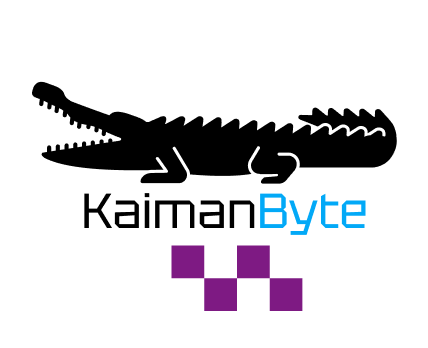

# Autoatendimento Secretaria Acadêmica - Fatec Jacareí

<p align="center">
  
</p>

<p align="center">
  <a href="#descrição-do-projeto">Sobre o Projeto</a> |
  <a href="#entregas-de-sprints">Entrega de Sprints</a> |
  <a href="#recursos-do-produto">Engenharia de Software</a> |
  <a href="#equipe">Nossa Equipe</a>
</p>

## Descrição do Projeto

A Secretaria Acadêmica da Fatec Jacareí recebe diariamente um grande volume de dúvidas recorrentes de alunos e interessados externos, o que gera sobrecarga operacional, aumento no tempo de resposta e risco de inconsistências nas orientações — especialmente em períodos críticos como rematrícula, trancamentos e exames finais.

Para resolver esse problema, desenvolvemos uma aplicação web de autoatendimento baseada em um chatbot conversacional. O sistema guia o usuário por uma árvore de navegação estruturada com menus e perguntas guiadas, cobrindo os temas mais frequentes: horários de aulas, calendário acadêmico, estágio supervisionado, dispensas e aproveitamento de disciplinas, e estrutura curricular dos cursos.

Ao final de cada atendimento, o sistema apresenta uma resposta objetiva e padronizada, acompanhada — quando aplicável — de um trecho extraído diretamente de documentos oficiais como o Regulamento Geral das Fatecs, o Manual de Estágio, o Calendário Acadêmico e os PPCs dos cursos. Essa abordagem garante rastreabilidade, confiabilidade da informação e redução de ambiguidades no atendimento.

<a id="sprint"></a>
## Entregas de Sprints

Todas as entregas serão realizadas conforme os prazos acordados com o cliente. Para cada ciclo de desenvolvimento, será gerado um relatório completo por sprint e uma planilha de tarefas, na aba **Tasks**. A relação detalhada das sprints e tarefas é apresentada abaixo.

<div align="center">

| Sprint | Entrega       | Status |                 Relatório                  |                Apresentação                |
|------: |---------------|:------:|:------------------------------------------:|:------------------------------------------:|
| 1      | 📅 04/05/2026 | ✅     | [Sprint Review](./arquivos/produto/sprints/Sprint1.md) | [Apresentação](https://www.youtube.com/watch?v=7bFm-wabf_s) |
| 2      | 📅 26/05/2026 | ✅     | [Sprint Review](./arquivos/produto/sprints/Sprint2.md) | [Apresentação](https://www.youtube.com/watch?v=TPTXaWIErNg) |
| 3      | 📅 09/06/2026 | ✅     | [Sprint Review](./arquivos/produto/sprints/Sprint3.md) | [Apresentação](https://youtu.be/1fbtvei8AE8) |

</div>

**Legenda:**
- ✅ **Finalizada**
- 🚧 **Em Progresso**
- `—` **Não iniciado**

## Recursos do Produto 

- **Backlog do Produto com DoD e DoR:** [Acesse aqui](./arquivos/produto/BacklogProduto.md)
Detalhamento completo dos requisitos funcionais e não funcionais do projeto, incluindo User Stories, critérios de entrada (DoR) e critérios de conclusão (DoD) de cada requisito.
- **Backlog das Sprints:** [Acesse aqui](./arquivos/produto/sprints/BacklogSprints.md)
Lista completa de tasks do projeto, com identificador, descrição da atividade, pontuação em Fibonacci e rastreabilidade com os requisitos atendidos.
- **Diagrama de Casos de Uso:** [Acesse aqui](./arquivos/produto/diagramas/CasoUso.png)  
Representação visual das interações entre os atores do sistema e as principais funcionalidades da aplicação.
- **Diagrama de Classes:** [Acesse aqui](./arquivos/produto/diagramas/DiagramaClasses.png)  
Representação visual da estrutura principal do sistema, destacando as classes, seus atributos e responsabilidades dentro da aplicação.
- **Diagrama de Sêquencia:** [Acesse aqui](./arquivos/produto/diagramas/DiagramasSequencia.pdf)  
Representação visual do fluxo de interação entre usuários, sistema e componentes da aplicação, demonstrando a ordem das mensagens trocadas e o comportamento do sistema durante a execução de cada funcionalidade.
- **Documentação de Testes:** [Acesse aqui](./arquivos/produto/DocumentacaoTestes.md)
  Registro dos testes realizados no sistema, incluindo os cenários avaliados, funcionalidades verificadas, resultados obtidos e evidências de validação das principais entregas do projeto.


## Stack

- Frontend: React + TypeScript + Vite
- Backend: Node.js + TypeScript + Express + JWT
- Banco de Dados: PostgreSQL
- Orquestração: Docker Compose

## Equipe

| Nome | Função | GitHub | LinkedIn |
|------|--------|--------|----------|
| Thiago Guedes | Product Owner | [Github](https://github.com/Thiago-Tolosa) | [LinkedIn](https://www.linkedin.com/in/thiago-guedes-4965b0390?utm_source=share_via&utm_content=profile&utm_medium=member_android) |
| João Pedro | Scrum Master | [Github](https://github.com/JoaoPedroLuvisariSeveriano) | [LinkedIn](https://www.linkedin.com/in/jo%C3%A3o-pedro-luvisari-severiano-bb1aa9303/) |
| Erick Rost | Desenvolvedor | [Github](https://github.com/erickrost) | [LinkedIn](https://www.linkedin.com/in/erick-rost/) |
| Vitória Vargas | Desenvolvedor | [Github](https://github.com/vitvargas) | [LinkedIn](http://www.linkedin.com/in/vit%C3%B3ria-barbara-vargas-9b920b351) |
| Rafael Melo | Desenvolvedor | [Github](https://github.com/RafaelPMR) | [LinkedIn](https://www.linkedin.com/in/rafael-prado-de-melo-raimundo-55a150144?utm_source=share&utm_campaign=share_via&utm_content=profile&utm_medium=ios_app) |
| Gabriel Oliveira | Desenvolvddor  | [Github](https://github.com/GabrielOlsa) | [LinkedIn](https://www.linkedin.com/in/gabriel-oliveira-96013138b?utm_source=share_via&utm_content=profile&utm_medium=member_android) |


## Estrutura

- `app/docker-compose.yml`: arquivo de orquestração dos containers da aplicação
- `app/.env`: variáveis utilizadas pelo backend ao executar via Docker Compose
- `app/backend/`: API HTTP com autenticação JWT, RBAC e módulos de negócio
- `app/backend/src/config/seed.ts`: carga inicial de dados da aplicação
- `app/frontend/`: interface React para navegação do autoatendimento

## Como subir a aplicação com Docker Compose

Pré-requisitos:

- Docker Engine e Docker Compose instalados.

Passo a passo:

1. Acesse a pasta `app`, onde está localizado o arquivo `docker-compose.yml`:
   ```bash
   cd app
   ```
2. Confira ou ajuste as variáveis no arquivo `.env` dessa pasta, principalmente as configurações de banco, porta do backend e URL do frontend.
3. Suba todos os containers:
   ```bash
   docker compose up --build -d
   ```
4. Verifique se os serviços estão em execução:
   ```bash
   docker compose ps
   ```
5. Para acompanhar logs:
   ```bash
   docker compose logs -f
   ```
6. Para parar o ambiente:
   ```bash
   docker compose down
   ```

> Também é possível executar o Compose a partir da raiz do repositório informando o caminho do arquivo:
> ```bash
> docker compose -f app/docker-compose.yml up --build -d
> ```

## URLs

Conforme o mapeamento de portas definido em `app/docker-compose.yml`:

- Frontend: `http://localhost:3000`
- Backend: `http://localhost:3001`
- pgAdmin: `http://localhost:5433`
- Healthcheck backend: `http://localhost:3001/health`
- PostgreSQL no host: `localhost:5434`

## Banco de Dados

- Durante a execução via Docker Compose, o backend acessa o PostgreSQL pelo host interno Docker `postgres` e pela porta `5432`.
- O serviço PostgreSQL é publicado no host pela porta `5434`, conforme o mapeamento `5434:5432` do Compose.
- Para administração do banco, utilize o pgAdmin disponível em `http://localhost:5433`.
- Configuração do servidor PostgreSQL no pgAdmin:
  - Host: `postgres`
  - Port: `5432`
  - Database: `chatbot_academico`
  - User: `postgres`
  - Password: `postgres`
- Para acesso direto pelo host, por ferramentas como DBeaver ou psql, use:
  - Host: `localhost`
  - Port: `5434`
  - Database: `chatbot_academico`
  - User: `postgres`
  - Password: `postgres`

## Usuários iniciais (seed)

- Admin: `admin@fatec.sp.gov.br` / `Admin@123`
- Secretária: `secretaria@fatec.sp.gov.br` / `Secretaria@123`


