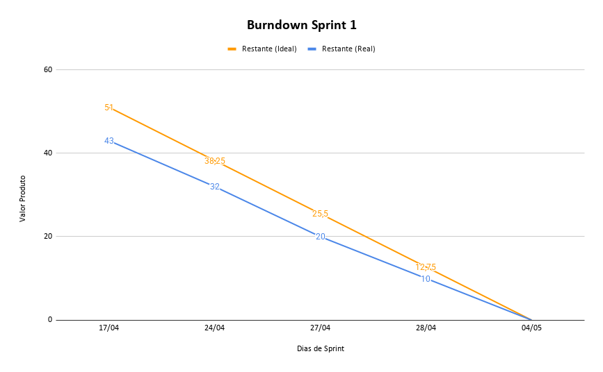

# Sprint 1

## 🎯 Objetivo da Sprint

Entregar o **design completo no Figma** e o **frontend estático em HTML e CSS** do site institucional do AgriRS-Lab.  
Foram definidos **cores, tipografia, espaçamentos e estilos**, criados **layouts de todas as páginas** e implementadas as seções com **header e footer padrão**, além da **configuração do ambiente (VSCode, Git e GitHub)**.

---

## Backlog Sprint 1 — MVP completo (chatbot do aluno + painel da secretária + login simples)

> Objetivo: aluno navega pelo chatbot, envia pergunta quando não acha o que quer e avalia o atendimento. Secretária consegue fazer login e visualizar e gerenciar as perguntas recebidas.

**Total Sprint 1: 51 pts**

| ID | Atividade | Pontos | Área | Requisito |
|----|-----------|:------:|------|-----------|
| T01 | Fazer o wireframe da tela inicial do chatbot (lista de opções principais) | 2 | Design | RF01 |
| T02 | Fazer o wireframe dos submenus do chatbot (navegação passo a passo) | 2 | Design | RF01 |
| T03 | Fazer o wireframe da tela de resposta final do chatbot | 1 | Design | RF01 |
| T04 | Fazer o wireframe do formulário para enviar pergunta à secretaria | 1 | Design | RF05 |
| T05 | Fazer o wireframe do botão de avaliação (Gostei / Não gostei) | 1 | Design | RF07 |
| T06 | Fazer o wireframe da tela de login | 1 | Design | RF09 |
| T07 | Fazer o wireframe do painel da secretária (lista de perguntas recebidas) | 2 | Design | RF06 |
| T11 | Definir as cores, fontes e estilos do projeto no Figma (design system básico) | 3 | Design | RNF01 |
| T13 | Validar os wireframes com o grupo e ajustar conforme feedback | 1 | Design | RNF01 |
| T14 | Criar a rota GET para listar os nós de navegação | 2 | Backend | RF01 |
| T15 | Criar as rotas POST, PUT e DELETE para gerenciar nós de navegação | 3 | Backend | RF01, RF04 |
| T19 | Criar a rota POST para receber e salvar a pergunta do aluno | 2 | Backend | RF05 |
| T20 | Criar a rota GET para listar as perguntas (para a secretária) | 2 | Backend | RF06 |
| T21 | Criar a rota PATCH para atualizar o status de uma pergunta | 2 | Backend | RF06 |
| T22 | Criar a rota POST para salvar a avaliação de satisfação | 2 | Backend | RF07 |
| T26 | Configurar variáveis de ambiente (.env) para dados sensíveis | 1 | Backend | RNF09 |
| T34 | Criar o componente de chatbot que mostra as opções do menu principal | 3 | Frontend | RF01 |
| T35 | Fazer o chatbot navegar pelos submenus conforme a escolha do aluno | 3 | Frontend | RF01 |
| T36 | Mostrar a resposta final ao aluno no chatbot | 2 | Frontend | RF01 |
| T37 | Criar o formulário para o aluno enviar pergunta à secretaria | 2 | Frontend | RF05 |
| T38 | Mostrar confirmação visual depois que o aluno enviar a pergunta | 1 | Frontend | RF05 |
| T39 | Criar o componente de avaliação (Gostei / Não gostei) no fim do atendimento | 2 | Frontend | RF07 |
| T40 | Criar a tela de login com campos de usuário e senha | 2 | Frontend | RF09 |
| T43 | Criar a lista de perguntas recebidas no painel da secretária | 3 | Frontend | RF06 |
| T44 | Criar o botão para a secretária atualizar o status de uma pergunta | 2 | Frontend | RF06 |
| T50 | Desenhar o diagrama de casos de uso | 3 | UML | RNF04 |

---

## Sprint Burndown

---

## 🔄 Retrospectiva da Sprint 1

Durante a Sprint 1, a equipe apresentou um nível de envolvimento e colaboração significativamente maior em comparação ao primeiro projeto desenvolvido pelo grupo. Houve uma melhor divisão das atividades entre as áreas de Design, Backend, Frontend e Modelagem UML, permitindo maior organização na execução das tasks previstas no backlog.

Ao longo da sprint, o time conseguiu evoluir tanto na comunicação quanto na integração entre os membros, o que contribuiu para a entrega de funcionalidades importantes do MVP, como a navegação do chatbot, o envio de perguntas para a secretaria, o sistema de avaliação de atendimento e o painel de gerenciamento para a secretária. Além disso, foram concluídas as definições visuais do projeto, criação de wireframes, implementação das rotas da API e componentes principais da interface.

Como resultado, a equipe conseguiu entregar um projeto funcional que atendeu aos requisitos definidos pelo cliente e alcançou os objetivos planejados para a sprint. O feedback recebido foi positivo, principalmente em relação à proposta de autoatendimento e à organização das funcionalidades entregues.

Apesar dos avanços técnicos e da melhora no trabalho em equipe, identificamos a necessidade de aprofundar os estudos sobre os fundamentos da metodologia Scrum e conceitos de Engenharia de Software. Durante a execução das atividades, surgiram dificuldades relacionadas ao refinamento das tarefas, estimativas de esforço, organização do fluxo de trabalho e entendimento mais estruturado das práticas ágeis. Dessa forma, nas próximas sprints, o grupo pretende focar não apenas na evolução técnica do sistema, mas também no amadurecimento da aplicação das metodologias de desenvolvimento utilizadas no projeto.