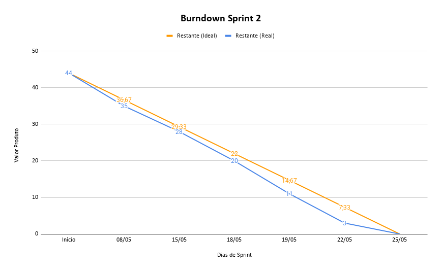

# Sprint 2

## 🎯 Objetivo da Sprint

Entregar um **incremento consistente do produto**, evoluindo a aplicação com foco em **segurança, autenticação, controle de acesso, painel administrativo e registros de atendimento**.

Nesta sprint, a equipe avançou na implementação de funcionalidades essenciais para o uso administrativo do sistema, incluindo autenticação com JWT, controle de permissões por papel de usuário, proteção de rotas, registro automático de logs de atendimento, visualização dos logs no painel administrativo e melhorias nas telas do painel.

Além da evolução técnica, a equipe também apresentou amadurecimento no uso do Scrum, com melhor organização das tarefas, maior clareza sobre os objetivos da sprint e melhor entendimento do fluxo de desenvolvimento incremental.

---

## Backlog Sprint 2 — Segurança, autenticação, painel administrativo e logs

> Objetivo: consolidar o painel administrativo, implementar autenticação segura, proteger rotas da aplicação, registrar logs de atendimento e melhorar a experiência de uso do sistema em diferentes dispositivos.

**Total Sprint 2: 44 pts**

| ID | Atividade | Pontos | Área | Requisito |
|----|-----------|:------:|------|-----------|
| T08 | Fazer o wireframe do painel do administrador — parte de nós de navegação | 2 | Design | RF04 |
| T09 | Fazer o wireframe do painel do administrador — parte de documentos | 2 | Design | RF04 |
| T10 | Fazer o wireframe do painel do administrador — parte de usuários e logs | 2 | Design | RF04, RF08 |
| T12 | Montar o protótipo navegável no Figma com o fluxo completo do aluno | 3 | Design | RF01–RF07 |
| T23 | Criar o serviço que grava o log de cada atendimento automaticamente | 3 | Backend | RF08 |
| T24 | Criar a rota GET para o administrador consultar os logs | 2 | Backend | RF08 |
| T29 | Salvar a senha do usuário com hash bcrypt no banco | 2 | Auth | RF09, RNF09 |
| T31 | Criar o middleware que verifica se o token JWT é válido em rotas protegidas | 3 | Auth | RF11 |
| T32 | Criar o middleware que verifica o papel do usuário (admin, secretária) antes de liberar a rota | 3 | Auth | RF10 |
| T33 | Testar acessos indevidos e confirmar que retorna 401 e 403 corretamente | 2 | Auth | RF10, RF11 |
| T41 | Salvar o token JWT no cliente após o login e redirecionar conforme o papel | 2 | Frontend | RF09 |
| T42 | Bloquear o acesso a páginas protegidas se o usuário não estiver logado | 2 | Frontend | RF10, RF11 |
| T45 | Criar a tela de gerenciamento de nós no painel do administrador | 3 | Frontend | RF04 |
| T48 | Criar a tela de visualização de logs no painel do administrador | 2 | Frontend | RF08 |
| T49 | Garantir que todas as telas funcionem bem no celular (responsividade) | 3 | Frontend | RNF01 |
| T51 | Desenhar o diagrama de classes | 3 | UML | RNF04 |
| T27 | Criar a rota POST /auth/login que valida usuário e senha | 2 | Auth | RF09 |
| T28 | Gerar o token JWT com ID do usuário, papel (role) e prazo de validade | 2 | Auth | RF09, RNF08 |
| T30 | Criar o logout (remover o token no lado do cliente) | 1 | Auth | RF09 |

---

## Sprint Burndown

---

## 🔄 Retrospectiva da Sprint 2

Durante a Sprint 2, a equipe apresentou uma evolução perceptível no uso do Scrum e na organização geral do processo de desenvolvimento. Em comparação com a sprint anterior, o grupo conseguiu compreender melhor a importância de planejar as entregas de forma incremental, dividir as atividades por áreas e acompanhar com mais clareza o que precisava ser desenvolvido ao longo da sprint.

O time também demonstrou maior maturidade na relação entre backlog, requisitos e implementação. As atividades foram melhor direcionadas para funcionalidades concretas do produto, permitindo que o incremento entregue tivesse mais consistência e maior impacto para o sistema como um todo.

A sprint trouxe avanços técnicos importantes, especialmente nas áreas de autenticação, autorização, segurança, logs e painel administrativo. A implementação de JWT, controle de acesso por papel, proteção de rotas e registro de atendimentos tornou o sistema mais próximo de um produto real, com preocupações relevantes de segurança, rastreabilidade e administração.

Outro ponto positivo foi a continuidade da integração entre frontend e backend. As funcionalidades implementadas passaram a se conectar melhor dentro do fluxo do usuário, desde o login até o acesso às páginas protegidas e à visualização das informações no painel administrativo.

Apesar dos avanços, a equipe reconhece que ainda há pontos a melhorar, principalmente na documentação técnica, padronização dos registros da sprint, detalhamento das evidências de entrega e refinamento das tarefas antes do início do desenvolvimento. Esses pontos serão importantes para as próximas etapas do projeto, especialmente para garantir maior clareza na validação das entregas e melhor rastreabilidade entre requisitos, backlog e código.

Como resultado, a Sprint 2 foi considerada positiva, pois entregou um incremento consistente do produto e demonstrou evolução tanto na parte técnica quanto na aplicação das práticas ágeis. Para a próxima sprint, o grupo pretende continuar aprimorando a organização do Scrum, melhorar a documentação das entregas e avançar nas funcionalidades relacionadas a documentos, busca de informações e consolidação final do sistema.