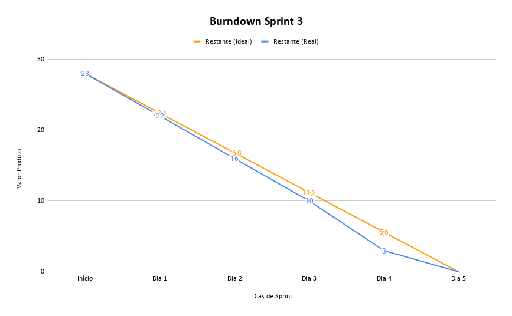

# Sprint 3

## 🎯 Objetivo da Sprint

Entregar a **versão final do produto**, consolidando as principais funcionalidades do sistema e finalizando a documentação técnica necessária para apresentação e entrega do projeto.

Nesta sprint, a equipe concentrou seus esforços na implementação das funcionalidades relacionadas ao **upload e gerenciamento de documentos**, incluindo a criação da rota para envio de arquivos, armazenamento das informações no banco de dados e preparação dos documentos para busca por meio da divisão em partes menores, conhecidas como chunks.

Além da evolução funcional, a Sprint 3 também teve forte foco em **documentação e modelagem do sistema**, contemplando a elaboração dos diagramas UML, documentação do modelo de dados, documentação das rotas da API e criação dos READMEs do projeto. Essas entregas foram importantes para tornar o sistema mais compreensível, rastreável e preparado para manutenção futura.

No frontend, a equipe avançou na construção das telas administrativas finais, incluindo o gerenciamento de documentos e o gerenciamento de usuários, complementando o painel administrativo iniciado nas sprints anteriores.

Por se tratar da última sprint do projeto, o foco principal foi consolidar o incremento final, organizar as entregas, documentar o sistema e garantir que as funcionalidades essenciais estivessem alinhadas aos requisitos definidos.

---

## Backlog Sprint 3 — Upload de documentos, gerenciamento final e documentação do sistema

> Objetivo: finalizar as funcionalidades principais do sistema, implementar o fluxo de upload e preparação de documentos para busca, concluir as telas administrativas restantes e consolidar a documentação técnica do projeto.

**Total Sprint 3: 28 pts**

| ID  | Atividade                                                                          | Pontos | Área     | Requisito  |
| --- | ---------------------------------------------------------------------------------- | :----: | -------- | ---------- |
| T16 | Criar a rota para fazer upload de documento e salvar no banco                      |    3   | Backend  | RF02, RF04 |
| T17 | Criar o serviço que divide o documento em partes menores para busca (chunks)       |    5   | Backend  | RF02       |
| T52 | Desenhar o diagrama de sequência                                                   |    3   | UML      | RNF04      |
| T53 | Desenhar o diagrama de componentes                                                 |    3   | UML      | RNF04      |
| T55 | Documentar o modelo de dados com o diagrama ER                                     |    2   | Docs     | RNF03      |
| T57 | Documentar todas as rotas e endpoints da API                                       |    3   | Docs     | RNF03      |
| T58 | Escrever o README principal do repositório                                         |    1   | Docs     | RNF07      |
| T59 | Escrever os READMEs das pastas backend e frontend com instruções de execução       |    2   | Docs     | RNF07      |
| T46 | Criar a tela de upload e gerenciamento de documentos no painel do administrador    |    3   | Frontend | RF04       |
| T47 | Criar a tela de gerenciamento de usuários (secretárias) no painel do administrador |    3   | Frontend | RF04       |

---

## Sprint Burndown

---

## 🔄 Retrospectiva da Sprint 3

Durante a Sprint 3, a equipe direcionou seus esforços para a finalização do projeto, priorizando as funcionalidades essenciais que ainda estavam pendentes e a consolidação da documentação técnica. Por ser a última sprint, o foco deixou de ser apenas a evolução incremental do produto e passou também a envolver a organização final das entregas, a rastreabilidade dos requisitos e a preparação do sistema para apresentação.

Um dos principais avanços técnicos da sprint foi a implementação do fluxo de upload de documentos. A criação da rota responsável por receber os arquivos e salvar suas informações no banco representou uma etapa importante para que o sistema pudesse atender ao objetivo de gerenciar documentos dentro do painel administrativo. Além disso, o desenvolvimento do serviço de divisão dos documentos em chunks contribuiu para preparar a aplicação para mecanismos de busca mais eficientes, permitindo que os conteúdos fossem tratados em partes menores e mais adequadas para consulta.

No frontend, a equipe deu continuidade à construção do painel administrativo, finalizando telas importantes para o uso do sistema pelo administrador. A tela de upload e gerenciamento de documentos complementou o fluxo iniciado no backend, enquanto a tela de gerenciamento de usuários permitiu ampliar o controle administrativo sobre os usuários do sistema, especialmente secretárias. Essas entregas ajudaram a consolidar o painel como uma área central de administração da aplicação.

Outro ponto relevante da Sprint 3 foi o avanço na documentação e na modelagem do sistema. A elaboração dos diagramas de sequência, componentes e ER contribuiu para representar melhor a arquitetura, o fluxo de funcionamento e a estrutura dos dados da aplicação. A documentação das rotas da API e a criação dos READMEs também foram importantes para facilitar a execução, entendimento e manutenção do projeto por outras pessoas.

Em relação ao Scrum, a equipe demonstrou maior maturidade quando comparada às sprints anteriores. O grupo passou a compreender melhor a relação entre backlog, requisitos, documentação e entrega final, organizando as atividades de forma mais objetiva. A experiência acumulada nas sprints anteriores ajudou na priorização das tarefas e na identificação do que era essencial para concluir o projeto de maneira consistente.

Apesar dos avanços, a equipe reconhece que ainda houve desafios, principalmente relacionados ao tempo disponível para refinamento final, testes mais detalhados e padronização completa da documentação. Como a última sprint concentrou tanto funcionalidades quanto documentação, algumas entregas exigiram maior esforço de organização e revisão para manter a coerência geral do projeto.

Mesmo com esses desafios, a Sprint 3 foi considerada positiva, pois permitiu consolidar o produto final, concluir funcionalidades importantes e fortalecer a base documental do sistema. Ao final da sprint, o projeto apresentou uma estrutura mais completa, com funcionalidades administrativas, autenticação, controle de acesso, logs, upload de documentos, gerenciamento de usuários e documentação técnica organizada.

Como resultado, a equipe encerrou o ciclo de desenvolvimento com um produto mais próximo da proposta inicial e com uma visão mais clara sobre o processo de construção incremental. A Sprint 3 marcou o fechamento do projeto, reunindo os aprendizados técnicos e metodológicos obtidos ao longo das três sprints.
